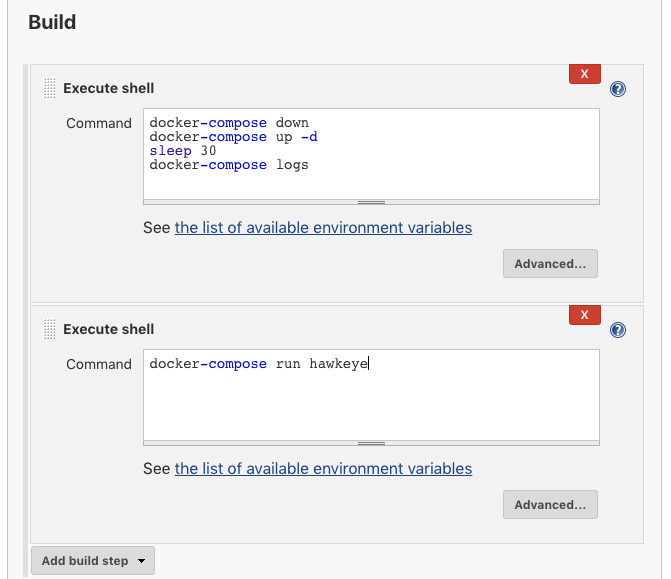

# Adding Hawkeye to the deploy pipeline

Add the following to the sample-flask-app's `docker-compose.yml` file:

```yaml
services:
  # ...
  hawkeye:
    image: stono/hawkeye
    command: scan --target /usr/src/app
    volumes_from:
      - web
```

Add a new “Execute shell” build step to run Hawkeye with the following command:

```sh
docker-compose run hawkeye
```

