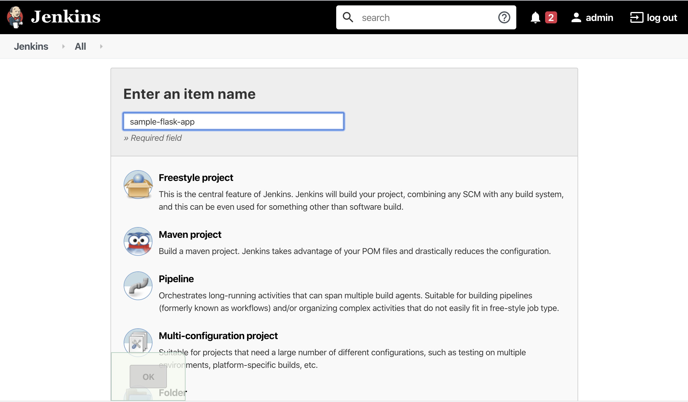
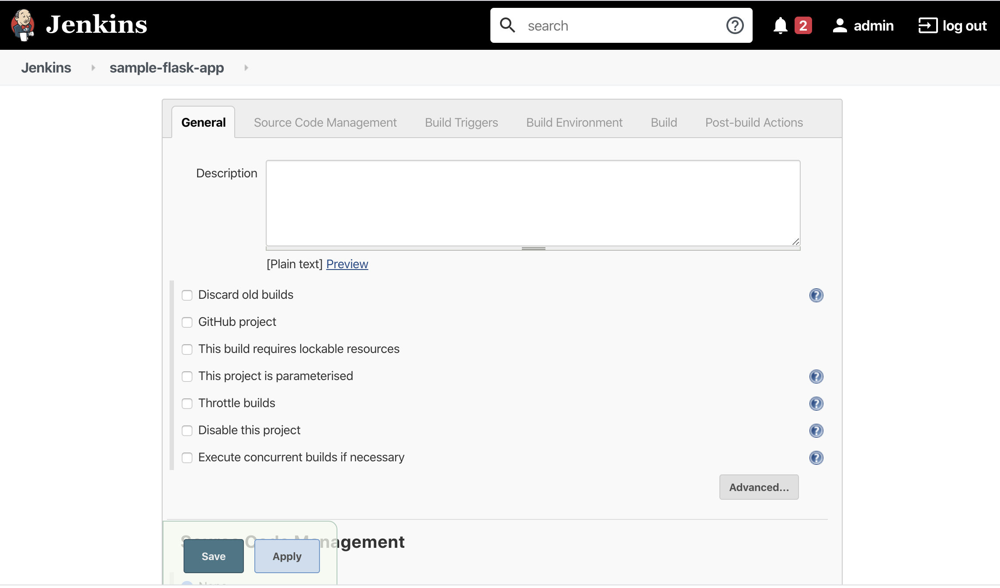
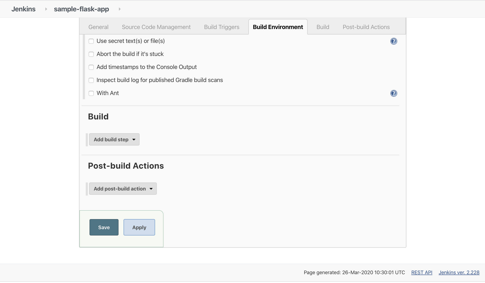
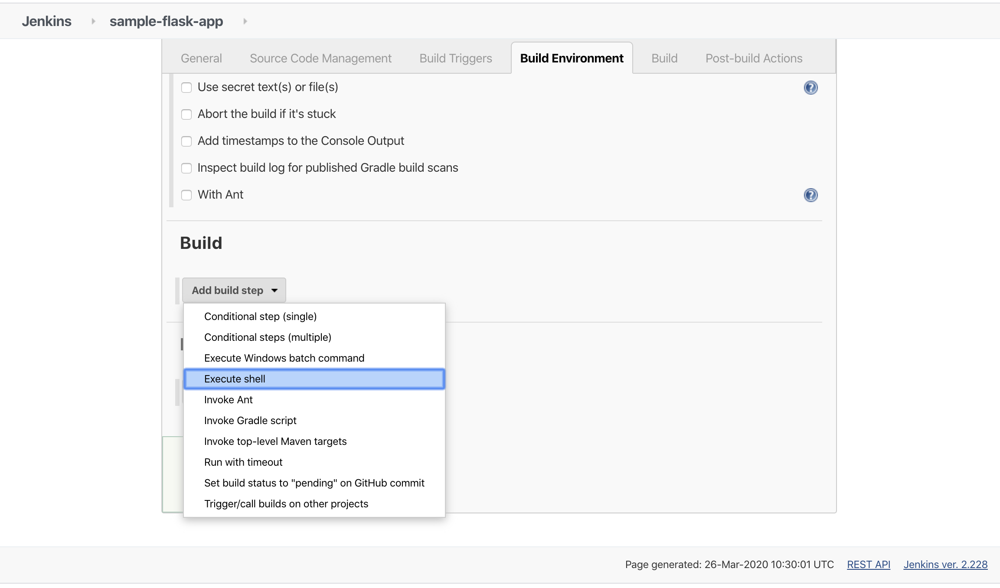
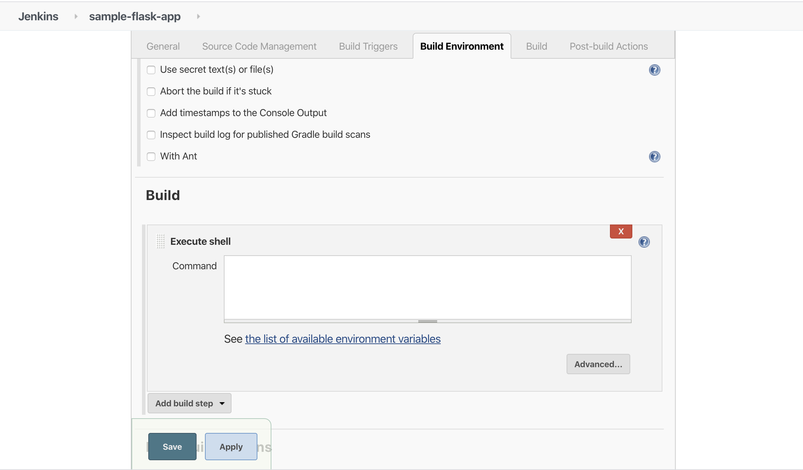
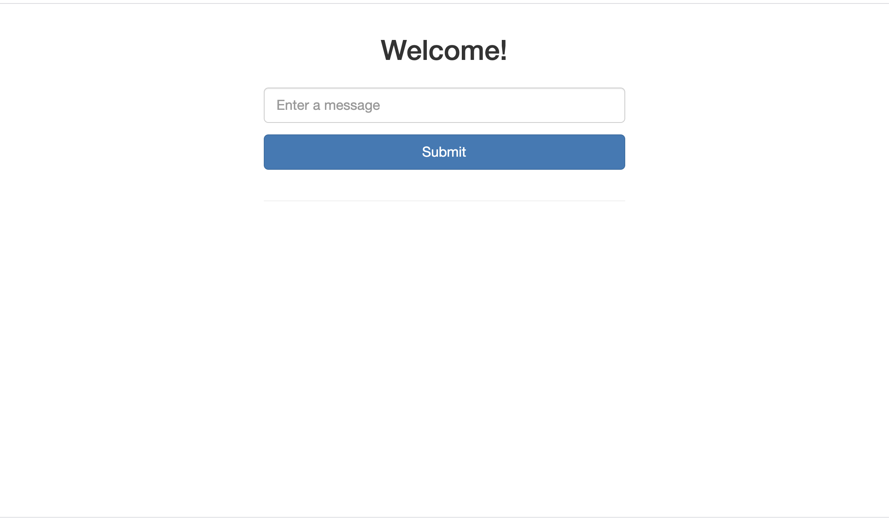

# Building the pipeline

From the side menu select `New item`.


Enter the name `sample-flask-app` for the project, select `Feestyle project` and click `OK`.



Under the heading `Source Code Management`, select the `Git` radio button.

Enter the URL of your fork of the `sample-flask-app` repository. e.g. `https://github.com/wilvk/sample-flask-app`



Under the heading `Build` select `Add build step`and thn seeleect `Execute shell`.



In the `Command` textbox enter the following:

```
docker-compose down
docker-compose up --detach --build
sleep 30
docker-compose logs
```

_(Note: if the build fails in the following steps, try increasing the sleep wait to 60 seconds or more)_

Then select `Save`.



Then from the main Jenkins menu select `Build Now`.

Your app should now be building. It should take up to a minute or so to complete.



Once the build has completed, browse to `localhost:8000` to see your app.


