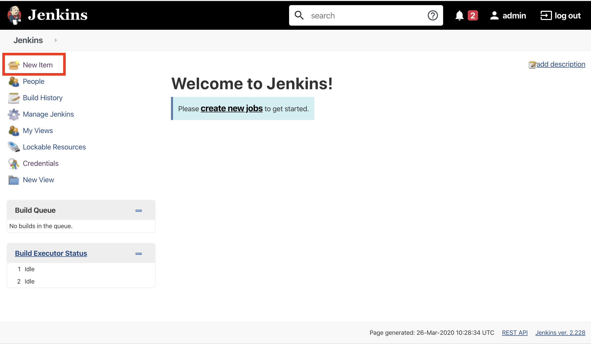
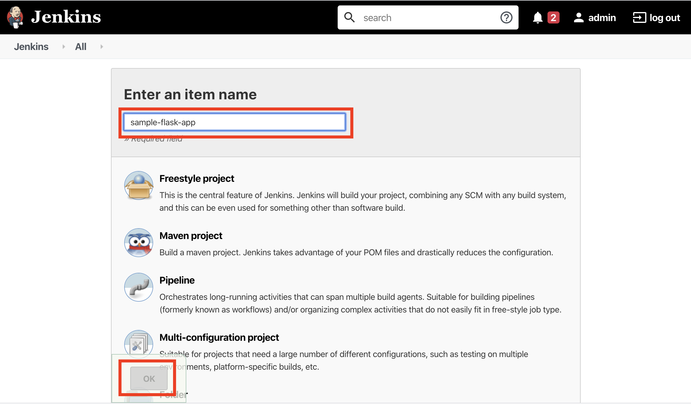
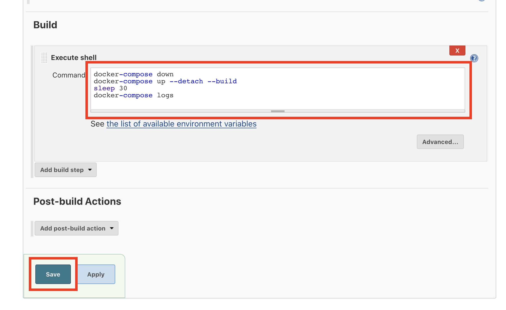
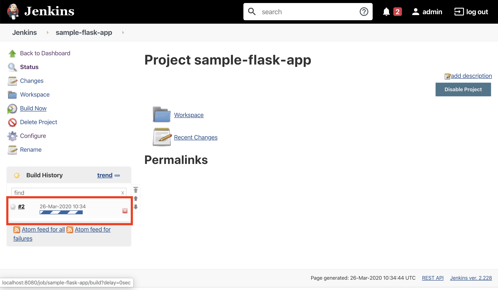

# Building the pipeline

## Job setup

From the side menu select `New item`.



Enter the name `sample-flask-app` for the project, select `Freestyle project` and click `OK`.



Under the heading `Source Code Management`, select the `Git` radio button.

Enter the URL of your fork of the `sample-flask-app` repository. e.g. `https://github.com/wilvk/sample-flask-app`


Under the heading `Build` select `Add build step` and then select `Execute shell`.


In the `Command` textbox enter the following:

```
docker-compose down
docker-compose up -d
sleep 30
docker-compose logs
```

Then select `Save`.



Then from the job task menu, select `Build Now`.

Your app should now be building. It should take up to a minute or so to complete.



Once the build has completed, browse to [localhost:8000](http://localhost:8000) to see your app.


