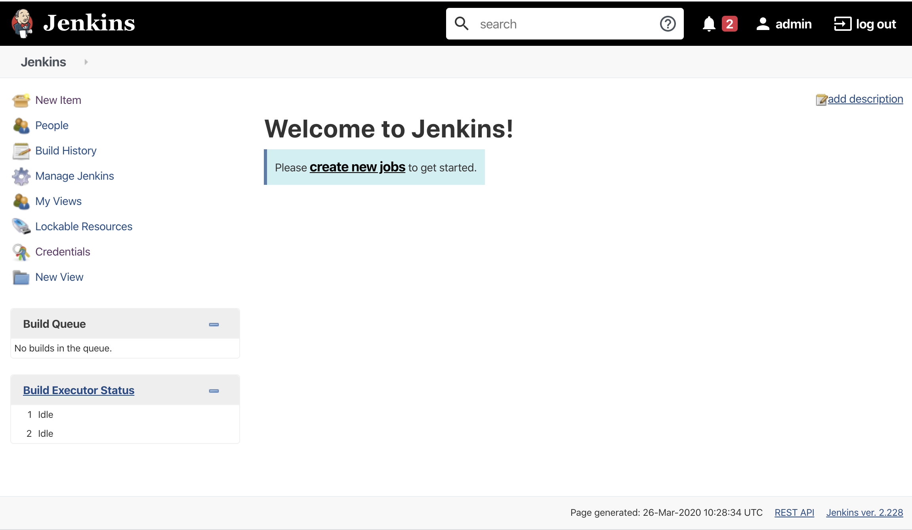

# Building the pipeline

From the side menu select 'New item'



Enter the name 'sample-flask-app' for the project, select 'Feestyle project' and click 'OK'


Under the heading 'Source Code Management', select the 'Git' radio button.
Enter the URL of your fork of the `sample-flask-app` repository. e.g. `https://github.com/wilvk/sample-flask-app`


Under the heading 'Build' select 'Add build step' > 'Execute shell'.


In the 'Command' box enter the following: 

```
docker-compose down
docker-compose up -d
sleep 30
docker-compose logs
```


Select 'Save'. Then from the main Jenkins menu select 'Build Now'.


Once the build has finished, browse to `localhost:8000` to see your app.


