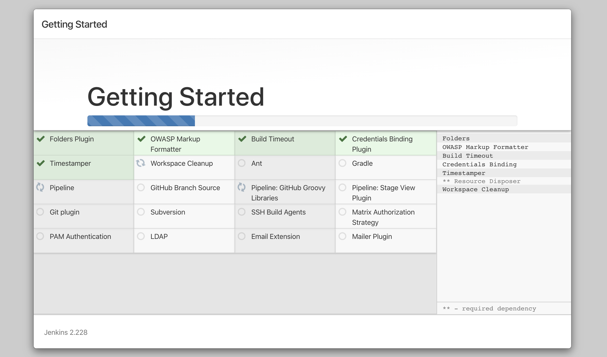
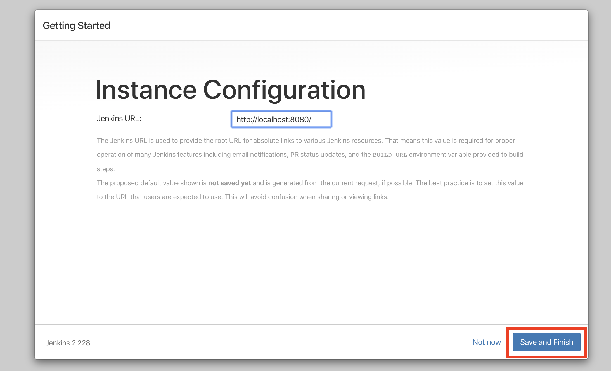

# Getting Started

After cloning this repository, you will need to source the file `SOURCEME.sh`.

For example:

```bash
source SOURCEME.sh
```

To start the Jenkins container, from the command line, enter `appsec_start`.

Once complete, you will see the Jenkins admin password to log into the Jenkins server.

```text
...
Successfully built fb2400e27e11
Successfully tagged jenkins-docker:latest
   -> Starting docker container for sample-deploy-pipeline... 
   -> Sleeping for 30 seconds before retrieving credentials... 
   -> Retrieving Jenkins admin credentials from Jenkins... 
     -> admin password: 1d3a35e2c74349fc9e2a1c3600201e60
   -> To access the Jenkins server, browse to 'http://localhost:8080'. 
➜  sample-deploy-pipeline git:(master)
```

## Setting up Jenkins

The Jenkins web server is on [localhost:8080](http://localhost:8080) You will see the following page.


The admin password is as described in the [Getting Started](#getting-started) section, or alternatively by running `appsec_get_jenkins_admin_creds`.

Install the recommended plugins


You will then see the plugins being installed.



Don't fill out any details on this form, just select `Continue as admin`.


Select `Save and Finish`.



Select `Start using Jenkins`.


Jenkins should now be setup.


