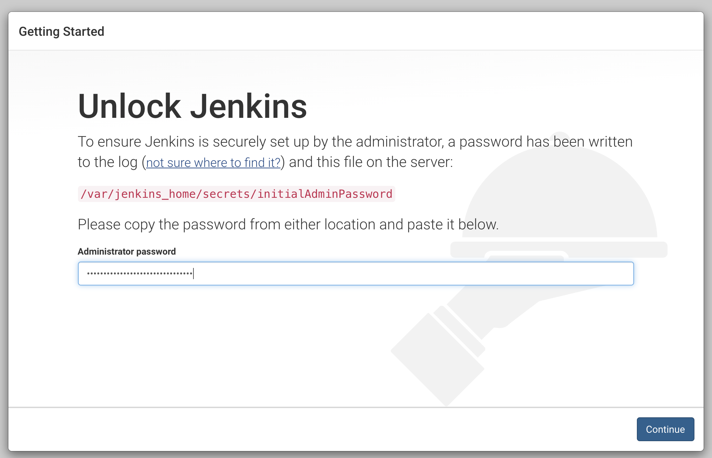
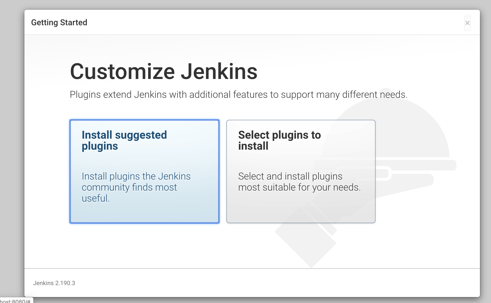
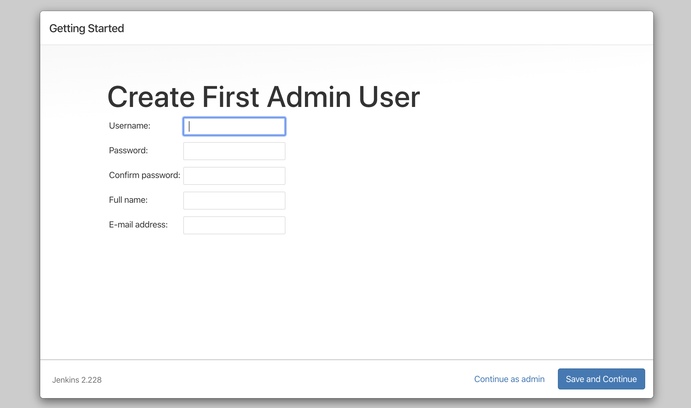
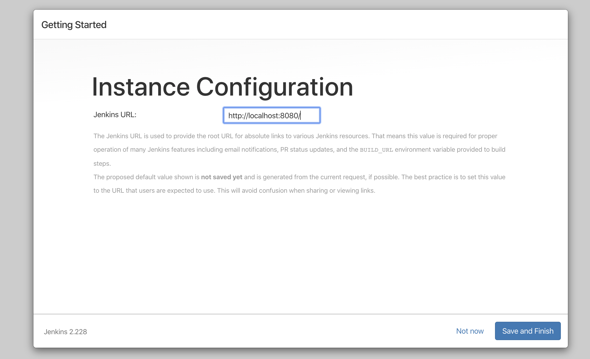
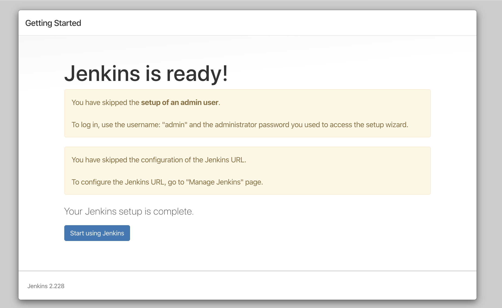

### Logging In

The Jenkins web server is on `localhost:8080` You will see the following page.

The admin password is as described in the [Getting Started](./getting-started.md) section, or alternatively by running `appsec_get_jenkins_admin_creds`.

Install the recommended plugins

You will then see the plugins being installed.

Select `Continue as admin`.

Select `Save and Finish`.

Select `Start using Jenkins`.

Jenkins should now be setup.

